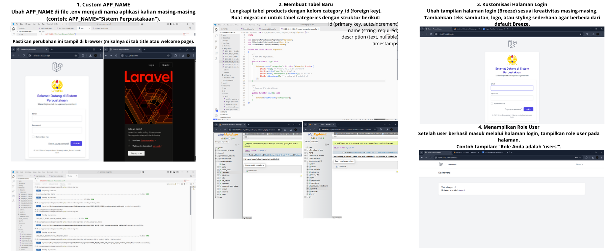

# 🚀 Praktikum Framework Pemrograman Web - Pertemuan 3

## 📌 Deskripsi Tugas

Project ini dibuat untuk memenuhi tugas Praktikum Mata Kuliah Framework Pemrograman Web pertemuan ketiga. Materi yang diimplementasikan meliputi:

Customisasi APP_NAME di file .env

Pembuatan tabel baru dan relasi antar tabel

Kustomisasi halaman login menggunakan Laravel Breeze

Menampilkan role user setelah login

Aplikasi ini merupakan sistem autentikasi sederhana berbasis Laravel 11 yang telah dimodifikasi sesuai instruksi praktikum.

---

## 📂 Struktur Project

sistem-perpustakaan/ ├── app/ ├── public/ │ └── images/ ├── resources/ │ └── views/ │ └── auth/ ├── routes/ │ └── web.php ├── database/ │ └── migrations/ └── README.md

---

## ⚙️ Fitur Routing yang Diimplementasikan

1. **Custom APP_NAME**
   APP_NAME diubah menjadi "Sistem Perpustakaan" dan ditampilkan di tab browser serta halaman welcome.

2. **Membuat Tabel Baru dan Relasi**

    - Tabel categories dibuat dengan kolom id, name, description, dan timestamps.

    - Tabel products ditambahkan kolom category_id sebagai foreign key ke categories.

3. **Kustomisasi Halaman Login**

    - Halaman login dimodifikasi dengan logo, teks sambutan, dan styling tambahan.

4. **Menampilkan Role User**

    - Setelah login, dashboard menampilkan teks: "Role Anda adalah 'users'"

    - Role dipilih saat registrasi melalui dropdown.

---

## 🖥️ Tampilan Aplikasi

Berikut adalah screenshot hasil ENV, MIGRATION DAN OTENTIKASI PADA LARAVEL 11 (dalam Kolase):

> **Catatan:** Folder `screenshots/` berisi hasil tangkapan layar aplikasi yang diambil dari browser dan tampilan kode di VS Code.

---

## 📎 Yang Dikumpulkan

1. **Tautan Repository GitHub** – berisi seluruh kode project dan folder `screenshots`.
2. **Screenshot Tampilan Aplikasi** – seperti yang ditampilkan di atas.

👨‍💻 Dibuat oleh
Nama: Nabilah A Alma
NIM:
2310-035
Mata Kuliah: Framework Pemrograman Web

## About Laravel

Laravel is a web application framework with expressive, elegant syntax. We believe development must be an enjoyable and creative experience to be truly fulfilling. Laravel takes the pain out of development by easing common tasks used in many web projects, such as:

-   [Simple, fast routing engine](https://laravel.com/docs/routing).
-   [Powerful dependency injection container](https://laravel.com/docs/container).
-   Multiple back-ends for [session](https://laravel.com/docs/session) and [cache](https://laravel.com/docs/cache) storage.
-   Expressive, intuitive [database ORM](https://laravel.com/docs/eloquent).
-   Database agnostic [schema migrations](https://laravel.com/docs/migrations).
-   [Robust background job processing](https://laravel.com/docs/queues).
-   [Real-time event broadcasting](https://laravel.com/docs/broadcasting).

Laravel is accessible, powerful, and provides tools required for large, robust applications.

## Learning Laravel

Laravel has the most extensive and thorough [documentation](https://laravel.com/docs) and video tutorial library of all modern web application frameworks, making it a breeze to get started with the framework.

You may also try the [Laravel Bootcamp](https://bootcamp.laravel.com), where you will be guided through building a modern Laravel application from scratch.

If you don't feel like reading, [Laracasts](https://laracasts.com) can help. Laracasts contains thousands of video tutorials on a range of topics including Laravel, modern PHP, unit testing, and JavaScript. Boost your skills by digging into our comprehensive video library.

## Laravel Sponsors

We would like to extend our thanks to the following sponsors for funding Laravel development. If you are interested in becoming a sponsor, please visit the [Laravel Partners program](https://partners.laravel.com).

### Premium Partners

-   **[Vehikl](https://vehikl.com)**
-   **[Tighten Co.](https://tighten.co)**
-   **[Kirschbaum Development Group](https://kirschbaumdevelopment.com)**
-   **[64 Robots](https://64robots.com)**
-   **[Curotec](https://www.curotec.com/services/technologies/laravel)**
-   **[DevSquad](https://devsquad.com/hire-laravel-developers)**
-   **[Redberry](https://redberry.international/laravel-development)**
-   **[Active Logic](https://activelogic.com)**

## Contributing

Thank you for considering contributing to the Laravel framework! The contribution guide can be found in the [Laravel documentation](https://laravel.com/docs/contributions).

## Code of Conduct

In order to ensure that the Laravel community is welcoming to all, please review and abide by the [Code of Conduct](https://laravel.com/docs/contributions#code-of-conduct).

## Security Vulnerabilities

If you discover a security vulnerability within Laravel, please send an e-mail to Taylor Otwell via [taylor@laravel.com](mailto:taylor@laravel.com). All security vulnerabilities will be promptly addressed.

## License

The Laravel framework is open-sourced software licensed under the [MIT license](https://opensource.org/licenses/MIT).
